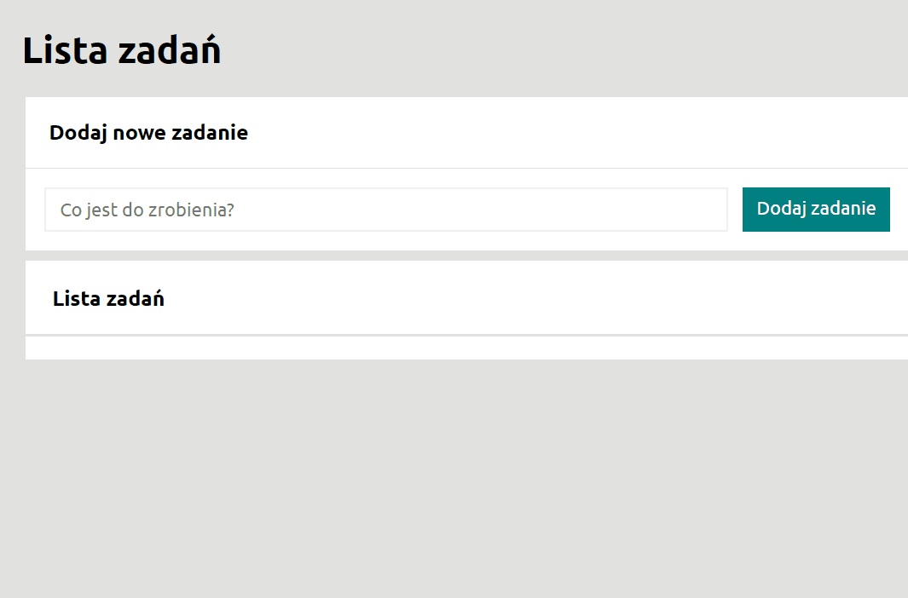

# To do list
## To do list
 https://radian31.github.io/To-do-list/

## DESCRIPTION
Welcome to my to-do list page. It is quite easy to use and with it you can manage your daily work schedule and more. Enter the task to be performed in the field and add it to the list using the button or by clicking ENTER. Below you can alternately mark a task as done or to do with the green button and delete it by clicking the red button. In addition, you can also use the two buttons above the list to change the interaction of tasks. With the former you can hide/show all completed tasks and with the latter you can complete them all.

## DEMO  

## Technologies

- HTML
- JAVASCRIPT ES6
- CSS (flex-box)
- normalize.css
- convention BEM
- Markdown
- Immutiability
